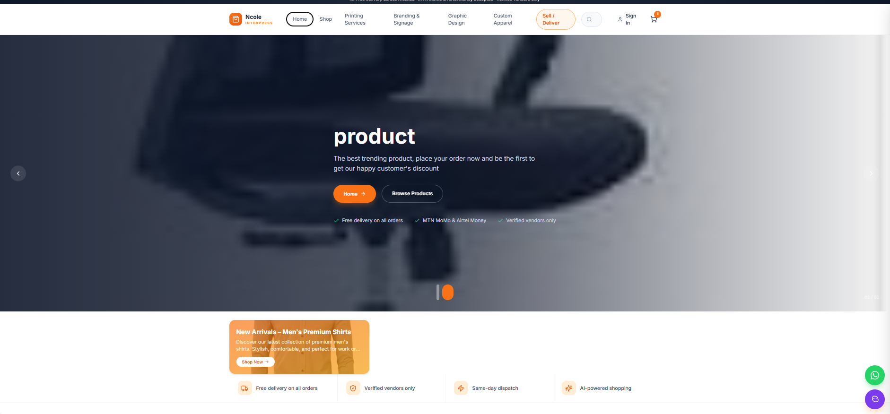
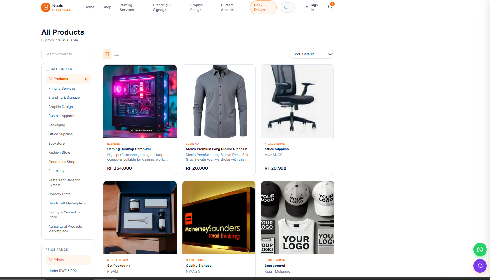
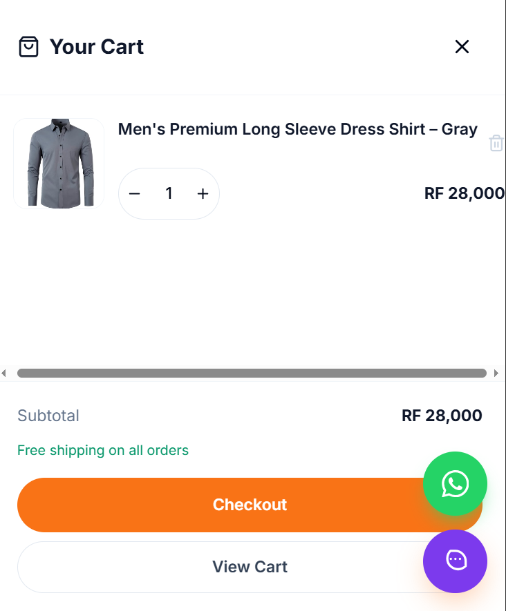
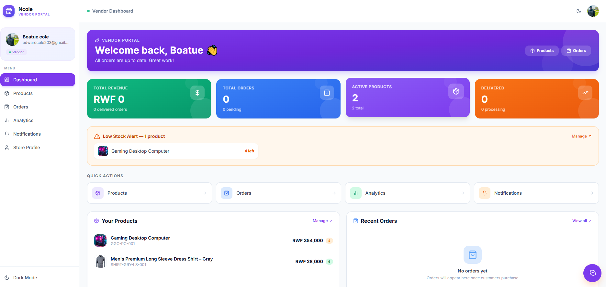
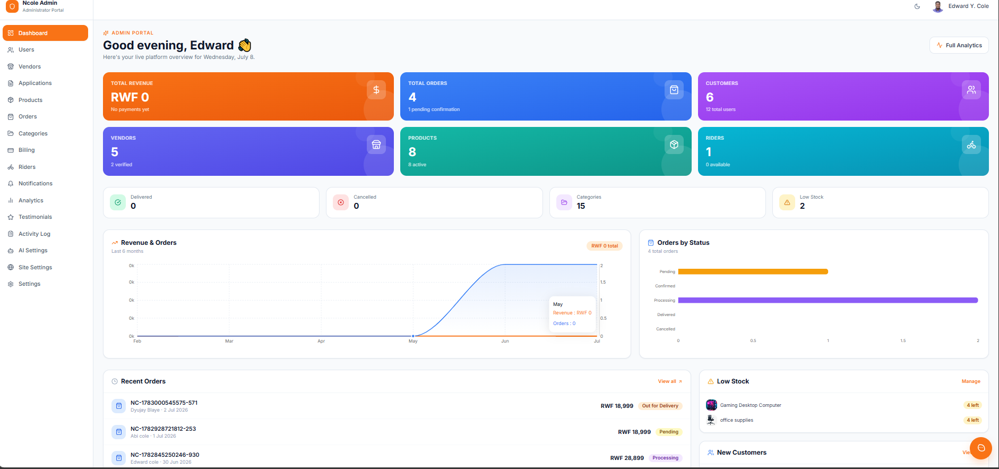
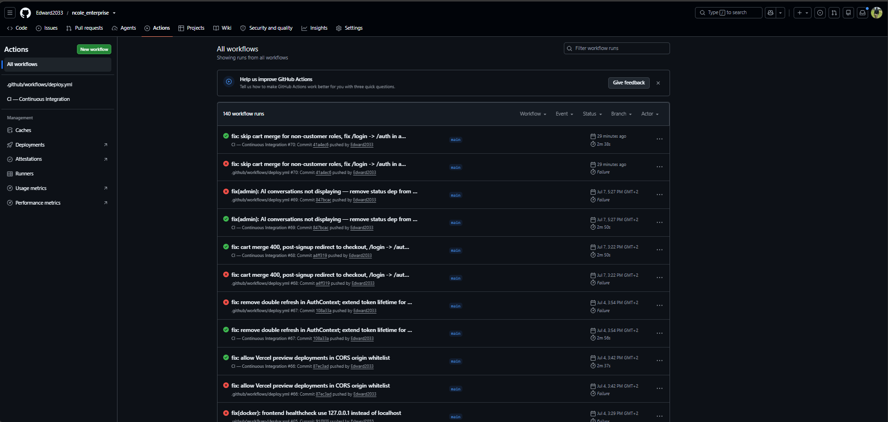
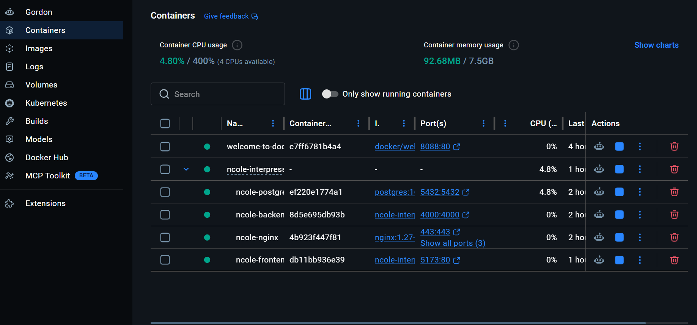

# N_COLE Interpress

> AI-powered multi-vendor e-commerce marketplace built for Rwanda and the wider African market.

[](https://github.com/Edward2033/ncole_enterprise/actions/workflows/ci.yml)
[](LICENSE)

**Live Demo:** https://ncole-enterprise.vercel.app  
**API:** https://ncole-enterprise.onrender.com/api/v1  
**Health Check:** https://ncole-enterprise.onrender.com/health

---

## About

N_COLE Interpress is a full-stack multi-vendor marketplace connecting product vendors, customers, delivery riders, and platform administrators through a single unified web application.

Built for the Rwandan market with native support for MTN Mobile Money and Airtel Money payments, and Google Gemini 2.0 Flash as a context-aware AI assistant across all five user portals.

**Business domain:** Printing, branding, office supplies, and business solutions.

---

## Features

### Customer Portal
- Browse products by category, keyword search, price filter, and sort
- Shopping cart with variant support — persisted to localStorage
- Checkout with saved delivery addresses and payment method selection
- Real-time order status tracking and order history
- Invoice viewing and payment submission (MTN MoMo, Airtel Money, Cash on Delivery)
- Product reviews and star ratings
- Wishlist management
- In-app notification centre
- AI assistant for order help and product recommendations

### Vendor Portal
- Product management: create, edit, delete, image upload via Cloudinary
- Variant management (size, colour, SKU, stock per variant)
- Order management and fulfilment workflow
- Sales analytics with revenue charts and top-product rankings
- AI assistant with live inventory and performance context

### Admin Portal
- Full platform management: users, vendors, products, orders, categories
- Payment verification and rejection workflow
- Maintenance mode toggle
- Broadcast notifications to all users
- Audit activity log with full action history
- AI-powered analytics assistant with platform-wide snapshot

### Rider Portal
- Assigned delivery management and status update workflow
- Earnings overview
- AI delivery guidance assistant

### Platform
- JWT authentication with refresh token rotation
- Role-based access control (ADMIN, VENDOR, CUSTOMER, RIDER)
- OTP two-factor authentication for VENDOR and RIDER logins
- Real-time stock management — stock decrements on order placement, restores on cancellation
- Concurrent order protection via database-level atomic updates
- Idempotent invoice generation
- Transactional email via Resend (OTP, password reset, approval notifications)
- Docker containerisation with multi-stage builds
- Automated CI/CD via GitHub Actions

---

## Tech Stack

| Layer | Technology |
|-------|-----------|
| Runtime | Node.js 20 |
| API Framework | Express.js + TypeScript |
| Database | PostgreSQL 16 (Supabase) |
| ORM | Prisma 5 |
| Authentication | JWT (access + refresh token rotation) |
| AI | Google Gemini 2.0 Flash |
| Frontend | React 18 + Vite + TypeScript |
| UI | Tailwind CSS + shadcn/ui |
| State | React Context API |
| Validation | Zod |
| Image Storage | Cloudinary |
| Email | Resend |
| Containerisation | Docker + Docker Compose |
| CI/CD | GitHub Actions |
| Deployment | Render (backend) + Vercel (frontend) |
| Reverse Proxy | Nginx |
| Logging | Winston |

---

## Screenshots

### Homepage


### Shop Page


### Product Detail


### Shopping Cart


### Vendor Dashboard


### Admin Dashboard


### CI/CD Pipeline


### Docker Containers


---

## Project Structure

```
N_cole/
├── .github/workflows/        # CI (ci.yml) and CD (deploy.yml) pipelines
├── backend/
│   ├── prisma/
│   │   ├── schema.prisma     # 20-model database schema
│   │   └── seed.ts           # Database seeder
│   └── src/
│       ├── config/           # Database, env validation, logger
│       ├── middleware/        # Auth, RBAC, rate limiter, validation, error handler
│       ├── modules/          # Feature modules (auth, products, orders, billing, ai, ...)
│       └── shared/           # Errors, types, response helpers
├── frontend/
│   └── src/
│       ├── components/       # Shared UI components and portal layouts
│       ├── contexts/         # Auth, Cart, Wishlist, SiteSettings contexts
│       ├── pages/            # All portal pages (admin/, vendor/, customer/, rider/)
│       ├── routes/           # Role-based route guards
│       └── services/         # Typed API client
├── nginx/                    # Reverse proxy configuration
├── docs/                     # API reference, database docs, DevOps guide
├── scripts/                  # DB backup/restore scripts
├── docker-compose.yml        # Production orchestration
├── docker-compose.dev.yml    # Development overrides (hot reload)
└── docker-compose.prod.yml   # Production overrides
```

---

## Getting Started

### Prerequisites

- Node.js 20+
- npm 10+
- PostgreSQL 16 (or a [Supabase](https://supabase.com) project)
- Docker + Docker Compose (optional)

### Clone

```bash
git clone https://github.com/Edward2033/ncole_enterprise.git
cd ncole_enterprise
```

---

## Environment Variables

### Backend

```bash
cd backend
cp .env.example .env
```

Edit `backend/.env`. Key variables:

| Variable | Required | Description |
|----------|----------|-------------|
| `DATABASE_URL` | ✅ | PostgreSQL pooler URL (PgBouncer, port 6543 for Supabase) |
| `DIRECT_URL` | ✅ | Direct PostgreSQL URL (port 5432) — used by Prisma migrations |
| `ACCESS_TOKEN_SECRET` | ✅ | JWT access token secret (min 32 chars) |
| `REFRESH_TOKEN_SECRET` | ✅ | JWT refresh token secret (min 32 chars, different from above) |
| `CORS_ORIGIN` | ✅ | Comma-separated list of allowed frontend origins |
| `APP_URL` | ✅ | Public frontend URL (used in email links) |
| `RESEND_API_KEY` | ✅ | Resend API key for transactional emails |
| `EMAIL_FROM` | ✅ | Sender address for outgoing emails |
| `GEMINI_API_KEY` | Optional | Google Gemini API key — AI endpoints degrade gracefully if unset |
| `CLOUDINARY_*` | Optional | Cloudinary credentials for image uploads |

Generate secure secrets:
```bash
node -e "console.log(require('crypto').randomBytes(64).toString('hex'))"
```

### Frontend

```bash
cd frontend
cp .env.example .env
```

| Variable | Required | Description |
|----------|----------|-------------|
| `VITE_API_URL` | ✅ | Backend API base URL, e.g. `http://localhost:4000/api/v1` |

> **Production deployments:** Environment variables are managed directly in the Render dashboard (backend) and Vercel dashboard (frontend). Do not commit `.env` files with real values.

---

## Running Locally

### Backend

```bash
cd backend
npm install
npx prisma generate
npx prisma db push        # or: npx prisma migrate dev
npm run dev               # starts on http://localhost:4000
```

### Frontend

```bash
cd frontend
npm install
npm run dev               # starts on http://localhost:5173
```

### Seed the database (optional)

```bash
cd backend
npm run prisma:seed
```

Creates an admin user and sample categories. Check `backend/prisma/seed.ts` for credentials.

---

## Production Build

### Backend

```bash
cd backend
npm run build
node dist/server.js
```

### Frontend

```bash
cd frontend
npm run build   # outputs to dist/
```

Serve `dist/` with any static file server (Nginx, Vercel, etc.).

---

## Database Setup

```bash
cd backend

# Apply all migrations to a fresh database
npx prisma migrate deploy

# (Development) Create a new migration after schema changes
npx prisma migrate dev --name describe_your_change

# Open Prisma Studio (visual DB browser)
npx prisma studio

# Reset database (dev only — destroys all data)
npx prisma migrate reset
```

### Supabase / PgBouncer note

Set two separate URLs in `backend/.env`:
- `DATABASE_URL` — the **pooler** URL (port 6543) with `?pgbouncer=true` — used at runtime
- `DIRECT_URL` — the **direct** URL (port 5432) — used only by Prisma migrations

---

## Docker

### Development (with hot reload)

```bash
docker-compose -f docker-compose.yml -f docker-compose.dev.yml up --build
```

| Container | Port | Purpose |
|-----------|------|---------|
| `ncole-postgres` | 5432 | PostgreSQL 16 |
| `ncole-backend` | 4000 | Express API |
| `ncole-frontend` | 5173 | React SPA (Nginx) |
| `ncole-nginx` | 8080 | Reverse proxy entry point |

### Production

```bash
cp backend/.env.example backend/.env
# Fill in all required variables

docker-compose -f docker-compose.yml -f docker-compose.prod.yml up -d --build
docker-compose exec backend npx prisma migrate deploy
```

---

## API Overview

Full API reference: [`docs/API.md`](docs/API.md)

Base URL: `/api/v1`

All responses follow a consistent envelope:
```json
{ "success": true, "data": {}, "meta": {} }
{ "success": false, "error": "message" }
```

### Key endpoints

| Method | Path | Auth | Description |
|--------|------|------|-------------|
| `POST` | `/auth/register` | Public | Register a new customer account |
| `POST` | `/auth/login` | Public | Login and receive JWT tokens |
| `POST` | `/auth/refresh` | Public | Rotate refresh token |
| `GET` | `/products` | Public | List products with filters |
| `GET` | `/products/:id` | Public | Get product by ID or slug |
| `POST` | `/orders` | Bearer | Place an order (decrements stock atomically) |
| `GET` | `/orders/my` | Bearer | Customer's order history |
| `PATCH` | `/orders/:id/status` | Bearer | Update order status |
| `GET` | `/billing/invoices` | Bearer | Customer invoices |
| `POST` | `/billing/invoices/:id/pay` | Bearer | Submit payment |
| `POST` | `/ai/chat` | Optional | AI assistant chat |
| `GET` | `/health` | Public | Health check |

---

## Deployment

The project is deployed on:

- **Backend:** [Render](https://render.com) — configured via `render.yaml`. Secrets are set in the Render dashboard under Environment Variables.
- **Frontend:** [Vercel](https://vercel.com) — auto-deploys on push to `main`. `VITE_API_URL` is set in the Vercel project settings.
- **CI/CD:** GitHub Actions runs type checks, builds, and Docker validation on every push. Deployment is triggered automatically on merge to `main`.

### Required GitHub Secrets (for CD pipeline)

| Secret | Description |
|--------|-------------|
| `RENDER_API_KEY` | Render API key |
| `RENDER_SERVICE_ID` | Render service ID for the backend |
| `BACKEND_URL` | Live backend URL for health checks |
| `PRODUCTION_DATABASE_URL` | Production DB pooler URL |
| `PRODUCTION_DIRECT_URL` | Production DB direct URL |
| `VERCEL_TOKEN` | Vercel deploy token |
| `VERCEL_ORG_ID` | Vercel organisation ID |
| `VERCEL_PROJECT_FRONTEND` | Vercel project ID for the frontend |

---

## Future Improvements

| Priority | Feature |
|----------|---------|
| High | Live MTN MoMo integration with real-time payment callbacks |
| High | WebSocket order tracking with live delivery location |
| High | Firebase Cloud Messaging push notifications |
| Medium | React Native apps for customers and riders |
| Medium | Redis caching for product listings and category trees |
| Medium | PostgreSQL `pg_trgm` full-text search |
| Low | Loyalty points redemption at checkout |
| Low | Automated vendor payout disbursement via MoMo API |
| Low | ML-based collaborative filtering recommendations |

---

## Contributing

1. Fork the repository
2. Create a feature branch: `git checkout -b feature/your-feature-name`
3. Commit with a descriptive message
4. Ensure the TypeScript build passes: `npm run build` in both `backend/` and `frontend/`
5. Open a Pull Request against `main`

### Code style

- TypeScript strict mode — no `any` types
- All API inputs validated with Zod schemas
- Follow the existing module pattern: `routes → controller → service`
- Keep controllers thin — business logic belongs in services

---

## License

[MIT](LICENSE) © N_COLE Interpress
