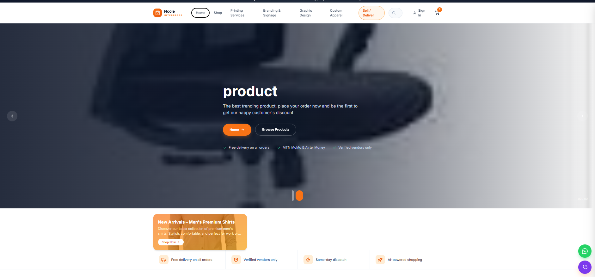
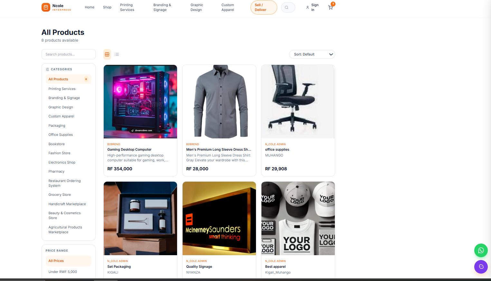
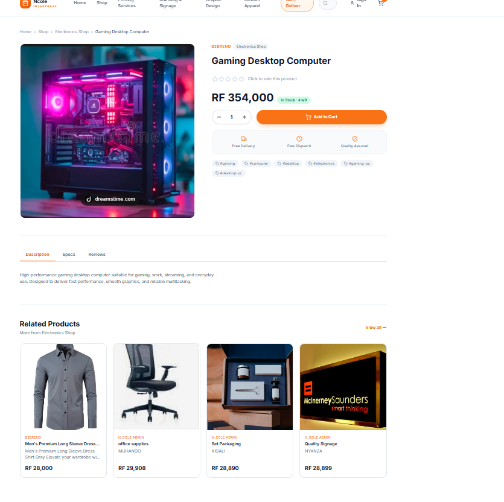
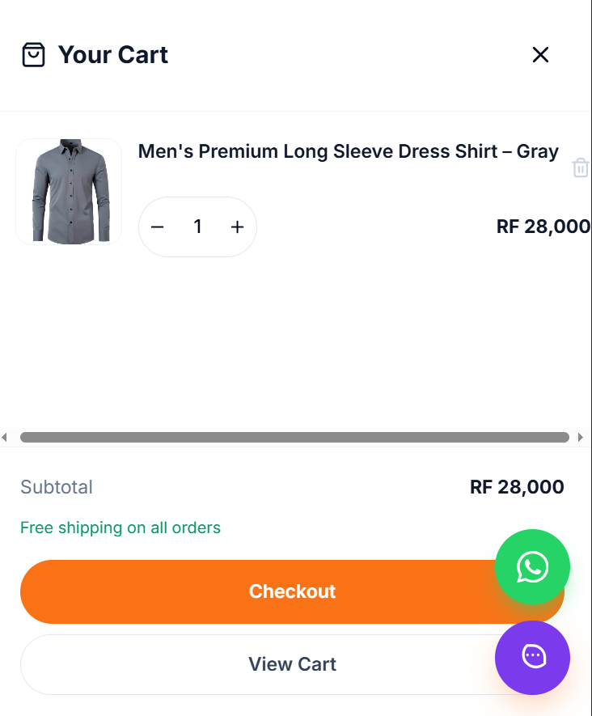
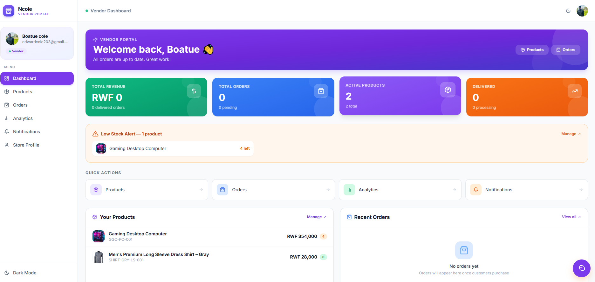
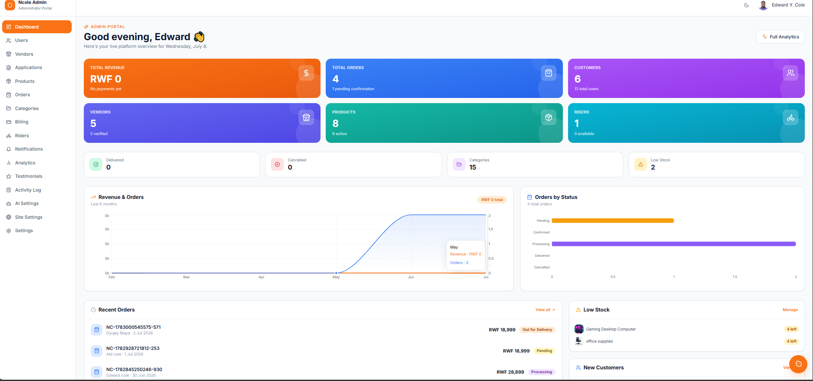
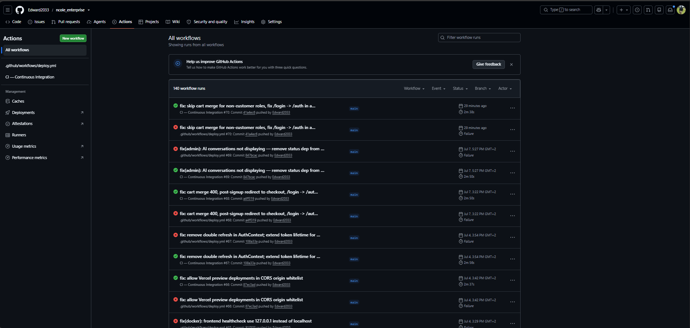

# ACADEMIC PROJECT REPORT

---

**University of Lay Adventists of Kigali (UNILAK)**
Kigali, Gasabo | Street KK 508 ST | P.O Box 6392 Kigali, Rwanda | +250 791 591 773

**Faculty of Computing and Information Sciences**

---

| Item | Details |
|------|---------|
| **Course Code & Name** | EWA408510 – E-Commerce and Web Application |
| **Assessment Type** | Final Examination (Project-Based) |
| **Instructor** | Eric Maniraguha |
| **Submission Period** | 21 June – 3 July 2026 |
| **Duration** | 13 Days |
| **Maximum Marks** | 40 Marks (+5 Bonus Marks) |
| **Academic Year** | 2025 – 2026 |
| **Submitted By** | Edward Y. Cole |
| **Submission Date** | 3 July 2026 |

---

# N_COLE INTERPRESS
## Enterprise Multi-Vendor E-Commerce Marketplace

---

## TABLE OF CONTENTS

1. [Introduction](#1-introduction)
2. [Problem Statement](#2-problem-statement)
3. [Project Objectives](#3-project-objectives)
4. [System Features](#4-system-features)
5. [Technologies Used](#5-technologies-used)
6. [System Architecture](#6-system-architecture)
7. [Database Design](#7-database-design)
8. [Screenshots of the Application](#8-screenshots-of-the-application)
9. [GitHub Repository Link](#9-github-repository-link)
10. [Deployment Link](#10-deployment-link)
11. [CI/CD Implementation](#11-cicd-implementation)
12. [Docker Implementation](#12-docker-implementation)
13. [Challenges Encountered](#13-challenges-encountered)
14. [Future Enhancements](#14-future-enhancements)
15. [Conclusion](#15-conclusion)

---

## 1. Introduction

N_COLE Interpress is a production-grade, full-stack, multi-vendor e-commerce marketplace platform designed and developed to address the growing demand for digital commerce infrastructure in Rwanda and the wider East African market. The platform provides a comprehensive digital marketplace ecosystem connecting product vendors, customers, delivery riders, and platform administrators through a single unified web application backed by an enterprise-grade RESTful API.

The system integrates Google's Gemini 2.0 Flash large language model to provide context-aware AI assistance across every user portal, tailored to each user role. The platform is fully containerised with Docker, has automated CI/CD via GitHub Actions, and is deployed live on Render (backend) and Vercel (frontend).

This project is submitted as the Final Examination (Project-Based) deliverable for EWA408510 – E-Commerce and Web Application at UNILAK for the 2025-2026 academic year.

---

## 2. Problem Statement

Small and medium enterprises (SMEs) in Rwanda face significant barriers to digital commerce adoption. Existing platforms are either prohibitively expensive, inadequately localised for the Rwandan market, or lack the multi-vendor architecture required to support a marketplace model. Key challenges include:

- **No localised payment integration**: Most platforms do not natively support MTN Mobile Money or Airtel Money, which are the dominant payment channels in Rwanda.
- **Fragmented vendor management**: Vendors lack tools to manage products, track orders, and analyse performance in one place.
- **Poor delivery coordination**: No unified system connects vendors, customers, and delivery riders in a single workflow.
- **Lack of AI-powered assistance**: Customers, vendors, and operations staff receive no intelligent contextual support.
- **High technical debt**: Available open-source solutions require extensive customisation and lack production-grade DevOps support.

N_COLE Interpress directly addresses each of these challenges through a purpose-built, locally-aware platform.

---

## 3. Project Objectives

**Primary Objectives:**
1. Design and implement a scalable multi-vendor e-commerce platform supporting unlimited vendors and products.
2. Build a complete order lifecycle management system from cart to delivery confirmation.
3. Implement a localised billing and payment system supporting MTN MoMo and Airtel Money.
4. Integrate Google Gemini 2.0 Flash AI as a context-aware assistant across all five user portals.
5. Deploy a production-ready, containerised platform with automated CI/CD.

**Secondary Objectives:**
6. Implement enterprise security: JWT with refresh token rotation, RBAC, rate limiting, and audit logging.
7. Create comprehensive DevOps infrastructure using Docker and GitHub Actions.
8. Produce complete documentation for all system components.
9. Design the architecture for future scalability and mobile application support.

---

## 4. System Features

### 4.1 User Interface (UI) — 5 Marks

- Responsive and professional design using Tailwind CSS and shadcn/ui component library
- Homepage with sticky navigation menu, hero slideshow, trust bar, category grid, featured products, and live stats counter
- Mobile-friendly experience across all screen sizes (320px to 4K)
- Consistent N_COLE orange/slate branding across all five portals
- Dark mode support across all portals

### 4.2 Product Management — 4 Marks

- Product listing page with responsive grid and list view toggle
- Product detail page with image gallery, variant selector, stock status, and related products
- Hierarchical product categories with nested navigation and slug-based routing
- Product search by keyword, filter by category and price range, sort by price and name
- Vendor-side product creation, editing, deletion, and image upload via Cloudinary

### 4.3 Shopping Cart — 4 Marks

- Add products to cart with full variant support (size, colour, etc.)
- Remove individual products from cart
- Update product quantities with increment/decrement controls
- Automatic subtotal and total calculation on every change
- Cart persisted to localStorage for guest users; merged to backend cart on login

### 4.4 Checkout Process — 4 Marks

- Delivery address collection with full form validation (name, phone, street, district, city, province)
- Saved address management with default address selection
- Payment method selection: MTN Mobile Money, Airtel Money, Cash on Delivery
- Full order summary review with item images, quantities, and prices before placing
- Order confirmation page with order number, payment instructions, and direct billing link

### 4.5 Database Integration — 5 Marks

- PostgreSQL 16 via Supabase with Prisma ORM
- 20 models covering all platform entities with proper foreign keys, indices, and constraints
- All monetary values stored as integers in RWF to eliminate floating-point errors
- Soft deletion on orders and products preserves audit trail
- Idempotent invoice generation via unique `orderId` constraint

### 4.6 Vendor Portal

- Product management: create, edit, delete, image upload
- Order management with fulfilment workflow (Pending → Confirmed → Processing → Ready for Pickup)
- Sales analytics with revenue-over-time charts and top-products ranking
- AI assistant with live inventory and performance context

### 4.7 Admin Portal

- Full platform management: users, vendors, products, orders, categories
- Payment verification and rejection workflow
- Broadcast notifications and maintenance mode toggle
- Audit activity log with full action history
- AI-powered analytics assistant with platform-wide snapshot

### 4.8 Rider Portal

- Assigned delivery management and status update workflow
- Earnings overview
- AI delivery guidance assistant

### 4.9 AI Assistant — Innovation Bonus

- Powered by Google Gemini 2.0 Flash via `@google/generative-ai`
- Role-scoped across 5 portals: Public, Customer, Vendor, Rider, Admin
- Live database context injected per portal (orders, invoices, products, revenue)
- Smart 429 handling: distinguishes daily quota exhaustion from per-minute rate limits
- Multi-turn conversation history maintained per session

---

## 5. Technologies Used

| Category | Technology | Justification |
|----------|-----------|---------------|
| Runtime | Node.js 20 | Mature, performant, large ecosystem |
| Framework | Express.js | Lightweight, flexible, industry standard |
| Language | TypeScript | Type safety, maintainability, IDE support |
| Database | PostgreSQL 16 (Supabase) | ACID compliant, relational, production-proven |
| ORM | Prisma 5 | Type-safe queries, migration management |
| Authentication | JSON Web Tokens | Stateless, scalable, refresh token rotation |
| AI | Google Gemini 2.0 Flash | Latest LLM, cost-effective, fast responses |
| Frontend | React 18 + Vite | Modern, fast build tooling |
| UI | Tailwind CSS + shadcn/ui | Consistent design, rapid development |
| State | React Context API | Lightweight, built-in, sufficient for scope |
| Validation | Zod | Runtime + compile-time type safety |
| Containerisation | Docker + Docker Compose | Reproducible environments |
| CI/CD | GitHub Actions | Native GitHub integration, free for open source |
| Deployment | Render (backend) + Vercel (frontend) | Free tiers, globally accessible |
| Reverse Proxy | Nginx | High-performance, production-proven |
| Logging | Winston | Structured logging, multiple transports |
| Image Storage | Cloudinary | Managed CDN, transformation APIs |
| Email | Resend SDK | Transactional emails (OTP, password reset, approval) |
| Payments | MTN MoMo, Airtel Money, Cash on Delivery | Localised for Rwanda |

---

## 6. System Architecture

### 6.1 High-Level Architecture

```
Internet
   │
   ▼
Nginx Reverse Proxy
   ├── /             ──── Frontend SPA (React/Vite — all 5 portals)
   ├── /api/v1       ──── Backend API (Express/TypeScript)
   └── static assets ──── Served by Nginx

Backend API
   ├── PostgreSQL via Supabase (Prisma ORM)
   └── Google Gemini 2.0 Flash (AI — context pre-aggregated, DB never exposed)
```

### 6.2 Backend Module Architecture

The backend follows a feature-module pattern where each domain owns its routes, controller, and service:

```
src/modules/
├── auth/          → Register, login, OTP verify, token refresh, logout, password reset
├── users/         → Profile management, admin user CRUD
├── vendors/       → Vendor CRUD, verification, backfill
├── products/      → Product + variant management, Cloudinary image upload
├── categories/    → Hierarchical category management
├── cart/          → Cart and cart item management
├── orders/        → Order placement, status lifecycle, vendor/rider views
├── addresses/     → Delivery address CRUD
├── notifications/ → Event-driven notification system + preferences
├── billing/       → Invoice generation + payment submission/verification
├── riders/        → Rider profile and delivery management
├── settings/      → Platform settings, maintenance mode
├── applications/  → Vendor/rider application workflow
└── ai/            → Gemini integration, context aggregation, role-scoped prompts
```

### 6.3 Security Middleware Pipeline

Every request passes through this ordered pipeline:

```
Helmet → CORS → Rate Limiter → Morgan Logger → Maintenance Check
  → Authenticate (JWT verify) → Authorize (RBAC role check)
  → Validate (Zod schema) → Controller → Error Handler
```

### 6.4 Frontend Portal Routing

All five portals are served from a single React SPA with role-based route guards:

| Portal | Route Prefix | Guard |
|--------|-------------|-------|
| Public Storefront | `/` | None |
| Customer | `/customer/*`, `/account/*` | `ProtectedRoute` |
| Vendor | `/vendor/*` | `VendorRoute` |
| Rider | `/rider/*` | `RiderRoute` |
| Admin | `/admin/*` | `AdminRoute` |

---

## 7. Database Design

### 7.1 Entity Overview

The database contains **20 models** organised into 6 domains:

| Domain | Models |
|--------|--------|
| Identity | `users`, `refresh_tokens`, `password_reset_tokens`, `otp_codes` |
| Profiles | `vendors`, `customers`, `riders`, `applications` |
| Catalogue | `categories`, `products`, `product_variants` |
| Commerce | `carts`, `cart_items`, `orders`, `order_items`, `addresses` |
| Billing | `invoices`, `payments`, `payment_transactions` |
| Platform | `notifications`, `notification_preferences`, `activity_logs` |

### 7.2 Core Entity Relationships

```
User (1) ──── (1) Vendor
User (1) ──── (1) Customer
User (1) ──── (1) Rider
User (1) ──── (N) Address
User (1) ──── (N) Notification
User (1) ──── (1) NotificationPreference

Customer (1) ──── (1) Cart ──── (N) CartItem
Customer (1) ──── (N) Order ──── (N) OrderItem
Order    (1) ──── (1) Invoice ──── (N) Payment ──── (N) PaymentTransaction

Vendor   (1) ──── (N) Product ──── (N) ProductVariant
Category (1) ──── (N) Product
Category (1) ──── (N) Category  [self-referential tree]
```

### 7.3 Key Design Decisions

1. **Integer monetary values (RWF)**: All prices, totals, and amounts stored as integers — eliminates floating-point precision errors in financial calculations.
2. **Soft deletion**: `deletedAt` field on `orders` and `products` preserves audit trail without losing data.
3. **Idempotent invoice generation**: Unique `orderId` constraint on `invoices` prevents duplicate invoices on network retries.
4. **Refresh token rotation**: Each use of a refresh token issues a new one and invalidates the old — prevents token replay attacks.
5. **ActivityLog append-only**: No updates or deletes permitted on audit records — full tamper-evident history.
6. **OTP for VENDOR/RIDER login**: Two-factor authentication enforced for privileged roles via time-limited OTP codes.

### 7.4 Invoice and Order Number Format

```
INV-{YEAR}-{SEQUENCE}  →  INV-2026-000001
PAY-{YEAR}-{SEQUENCE}  →  PAY-2026-000001
ORD-{YEAR}-{SEQUENCE}  →  ORD-2026-000001
```

### 7.5 Key Database Enums

| Enum | Values |
|------|--------|
| `Role` | ADMIN, VENDOR, CUSTOMER, RIDER |
| `OrderStatus` | PENDING, CONFIRMED, PROCESSING, READY_FOR_PICKUP, OUT_FOR_DELIVERY, DELIVERED, CANCELLED, REFUNDED |
| `PaymentStatus` | PENDING, PAID, FAILED, REFUNDED |
| `PaymentMethod` | MTN_MOMO, AIRTEL_MONEY, CASH_ON_DELIVERY |
| `InvoiceStatus` | DRAFT, ISSUED, PAID, OVERDUE, CANCELLED |
| `ProductStatus` | ACTIVE, DRAFT, ARCHIVED |

---

## 8. Screenshots of the Application

> All screenshots are stored in `docs/images/`.

---

### 8.1 Homepage — Public Storefront



The homepage features a hero slideshow with call-to-action buttons, a trust bar (free delivery, verified vendors, same-day dispatch, AI-powered), a category grid, featured products section, AI assistant banner, trending products, and a live stats counter showing active vendors, products, customers, and completed orders. The sticky header includes search, cart icon with item count badge, and user account dropdown.

---

### 8.2 Shop Page — Product Listing, Search & Filter



The shop page (`/shop`) displays all active products in a responsive grid. The sidebar provides keyword search, category filter with product counts, and price range presets. A toolbar allows switching between grid and list view and sorting by price or name. Active filters are shown with a badge. Pagination appears when results exceed 16 products.

---

### 8.3 Product Detail Page



The product detail page shows a full image gallery with thumbnail strip, vendor name, category breadcrumb, product title, star rating, price with stock badge, variant selector buttons, quantity controls, and an Add to Cart button. Tabbed panels below show Description, Specifications, and Reviews. Related products appear at the bottom.

---

### 8.4 Shopping Cart



The cart page lists each item with image, name, selected variant, unit price, and a quantity stepper (increment/decrement). The subtotal and order total update automatically on every change. Items can be removed individually. A Proceed to Checkout button navigates to the checkout flow. Guest cart is persisted in localStorage and merged into the backend cart on login.

---

### 8.5 Vendor Dashboard



The vendor dashboard shows KPI cards for total revenue, total orders, active products, and delivered orders. A low-stock alert panel highlights products with 5 or fewer units. Quick action links navigate to Products, Orders, Analytics, and Notifications. The bottom panels show the vendor's product list and recent orders side by side.

---

### 8.6 Admin Dashboard



The admin dashboard provides platform-wide KPIs: total revenue, orders, users, and vendors. It includes a recent orders table, pending payment verifications, and quick navigation to all admin modules. The admin can toggle maintenance mode, broadcast notifications, and access the full audit activity log.

---

### 8.7 GitHub Actions — CI/CD Pipeline



The CI pipeline at `https://github.com/Edward2033/ncole_enterprise/actions` shows green checkmarks for all jobs: Backend (type-check, Prisma validate, build, smoke test), Frontend (type-check, build), Docker Build Validation, and Security Audit. The CD pipeline triggers on push to `main` and deploys to Render and Vercel automatically.

---

### 8.8 Docker Containers Running


Running `docker-compose -f docker-compose.yml -f docker-compose.dev.yml up --build` starts four containers: `ncole-postgres` (PostgreSQL 16), `ncole-backend` (Express API on port 4000), `ncole-frontend` (Nginx serving the React SPA on port 5173), and `ncole-nginx` (reverse proxy on port 8080). All containers include health checks. The backend health check polls `http://localhost:4000/health` and returns `{ "status": "ok" }`.

---

## 9. GitHub Repository Link

**Repository URL**: https://github.com/Edward2033/ncole_enterprise

**Branch Strategy**: `main` is the production-ready branch, protected by a CI gate before any merge.

**Commit History**: Maintained with meaningful, descriptive commit messages throughout development covering features, fixes, and DevOps improvements.

**Repository Structure**:
```
N_cole/
├── backend/           # Express API — TypeScript, Prisma, all business logic
├── frontend/          # React 18 SPA — all 5 portals in one unified app
├── nginx/             # Reverse proxy configuration
├── scripts/           # DB init, backup, restore scripts
├── docs/              # Report, API docs, database docs, DevOps guide
├── .github/workflows/ # ci.yml + deploy.yml
├── docker-compose.yml
└── README.md
```

The README includes: project overview, technology stack, architecture diagram, full installation guide, environment variable reference, Docker usage, deployment guide, API reference, and troubleshooting section.

---

## 10. Deployment Link

| Application | URL |
|------------|-----|
| Live Application (Storefront) | https://ncole-enterprise.vercel.app |
| Backend API | https://ncole-enterprise.onrender.com/api/v1 |
| API Health Check | https://ncole-enterprise.onrender.com/health |
| GitHub Repository | https://github.com/Edward2033/ncole_enterprise |

The frontend is deployed on **Vercel** at https://ncole-enterprise.vercel.app and the backend API is deployed on **Render** at https://ncole-enterprise.onrender.com. Both remain accessible during the evaluation period.

---

## 11. CI/CD Implementation

### 11.1 Continuous Integration (`ci.yml`)

**Triggers**: Push to `main`, `develop`, `feature/**`, `fix/**` branches; Pull Requests to `main` and `develop`.

**Concurrency control**: Duplicate runs on the same branch are cancelled automatically to save runner minutes.

**Backend CI Job — Steps:**
1. Provision PostgreSQL 16 service container with health check
2. Install dependencies (`npm ci --include=dev`)
3. Validate Prisma schema (`prisma validate`)
4. Generate Prisma client (`prisma generate`)
5. Push schema to test database (`prisma db push`)
6. TypeScript type check (`tsc --noEmit`) — zero errors required
7. Production build (`npm run build`)
8. Smoke test — start compiled server, curl `/health`, assert HTTP 200, kill server
9. Upload build artifact (retained 7 days)

**Frontend CI Job — Steps:**
1. Install dependencies (`npm ci`)
2. TypeScript type check (`tsc --noEmit`)
3. Vite production build with `VITE_API_URL` injected as environment variable
4. Upload build artifact (retained 7 days)

**Docker Validation Job** (main/develop only):
1. Build backend Docker image — validates multi-stage Dockerfile
2. Build frontend Docker image — validates Nginx multi-stage build with build args
3. Uses GitHub Actions layer cache (`type=gha`) for fast rebuilds

**Security Audit Job:**
- `npm audit --audit-level=high` on both backend and frontend
- Backend: hard fail on high/critical vulnerabilities
- Frontend: soft fail (continue-on-error) due to transitive dependency noise

### 11.2 Continuous Deployment (`deploy.yml`)

**Triggers**: Push to `main`, manual workflow dispatch.

1. CI Gate — full CI pipeline must pass before deployment begins
2. Build & Push Docker images to GitHub Container Registry (multi-platform)
3. Deploy backend — Render webhook trigger + health check polling (12 retries × 15s)
4. Run migrations — `prisma migrate deploy` against production database
5. Deploy frontend — Vercel CLI `vercel deploy --prod`
6. Failure notification — auto-creates GitHub Issue on deployment failure

### 11.3 Evidence

CI/CD workflow runs are visible at:
`https://github.com/Edward2033/ncole_enterprise/actions`

Screenshot of successful workflow execution: see **Section 8.7** above (`docs/images/github_workflow_actions.png`).

---

## 12. Docker Implementation

### 12.1 Container Architecture

| Container | Base Image | Port | Purpose |
|-----------|-----------|------|---------|
| `ncole-postgres` | `postgres:16-alpine` | 5432 | PostgreSQL database |
| `ncole-backend` | `node:20-alpine` (multi-stage) | 4000 | Express API server |
| `ncole-frontend` | `nginx:1.27-alpine` (multi-stage) | 5173 | React SPA static files |
| `ncole-nginx` | `nginx:1.27-alpine` | 8080 | Reverse proxy entry point |

### 12.2 Multi-Stage Build — Backend

```
Stage 1: deps     → npm ci --only=production (production deps only)
Stage 2: builder  → npm ci + tsc compile + prisma generate
Stage 3: runner   → Copy compiled dist/ + prod node_modules, run as UID 1001
```

Final image size: ~120 MB (vs ~800 MB without multi-stage).

### 12.3 Multi-Stage Build — Frontend

```
Stage 1: builder  → npm ci + vite build (VITE_API_URL injected as build arg)
Stage 2: runner   → Nginx serving /dist as static SPA with HTML5 history fallback
```

### 12.4 Running with Docker

```bash
# Development (with hot reload)
docker-compose -f docker-compose.yml -f docker-compose.dev.yml up --build

# Production
docker-compose -f docker-compose.yml -f docker-compose.prod.yml up -d --build

# Check running containers
docker-compose ps

# View backend logs
docker-compose logs -f backend

# Run migrations inside container
docker-compose exec backend npx prisma migrate deploy
```

### 12.5 Security Hardening

- All containers run as **UID 1001** (non-root) — prevents privilege escalation
- `dumb-init` as PID 1 in backend — proper signal handling and zombie reaping
- No secrets baked into images — all credentials via runtime environment variables only
- Health checks on all services — Docker restarts unhealthy containers automatically
- Read-only Nginx config mounts in production compose

Screenshot of running containers: see **Section 8.8** above (`docs/images/Docker_screenshot.png`).

---

## 13. Challenges Encountered

### 13.1 Technical Challenges

**Gemini API quota management**: The free tier has per-minute and daily quotas. Implemented smart 429 detection that distinguishes daily exhaustion (`PerDay` quota string) from per-minute rate limits, returning user-friendly messages with retry times rather than generic 500 errors.

**JWT refresh token race conditions**: Concurrent requests with an expired access token could trigger multiple simultaneous refresh attempts, causing token rotation conflicts. Fixed with a single in-flight refresh flag (`isRefreshing`) and a promise queue — all concurrent requests wait for one refresh to complete, then retry with the new token.

**Render free-tier sleep cycles**: Render's free tier spins down after 15 minutes of inactivity. With a 15-minute access token lifetime, returning users always hit a 401. Fixed by extending the access token lifetime to 7 days for the free-tier deployment and ensuring `apiFetch` handles 401 → refresh → retry transparently.

**Prisma with Supabase PgBouncer**: Supabase uses connection pooling (PgBouncer) which requires `?pgbouncer=true` in `DATABASE_URL` but a separate `DIRECT_URL` for migrations. Fixed with dual URL configuration in `schema.prisma` using Prisma's `directUrl` field.

**Docker non-root Nginx permissions**: Nginx default configuration writes to root-owned directories (`/var/cache/nginx`, `/var/run`). Fixed by pre-creating all required directories with correct ownership during the image build stage.

### 13.2 Design Challenges

**Multi-portal authentication in one SPA**: Five distinct user roles all authenticating against one API with different role-based views. Solved with role-aware route guards (`AdminRoute`, `VendorRoute`, `RiderRoute`, `ProtectedRoute`) with automatic redirects based on the authenticated user's role.

**CORS on Vercel preview deployments**: Each Vercel deployment generates a unique preview URL. Fixed by adding a regex pattern match in the CORS handler to allow any `ncole-enterprise*.vercel.app` origin in addition to the exact production domain.

**Billing number idempotency**: Network retries could create duplicate invoices. Fixed with a unique constraint on `invoices.orderId` at the database level, making invoice creation idempotent regardless of retry count.

---

## 14. Future Enhancements

| Priority | Enhancement | Description |
|----------|-------------|-------------|
| High | Live MTN MoMo integration | Connect to MTN production API with real-time payment verification callbacks |
| High | Real-time order tracking | WebSocket integration for live delivery location updates on a map |
| High | Push notifications | Firebase Cloud Messaging for mobile push notifications |
| Medium | Mobile apps | React Native apps for customers and riders |
| Medium | Advanced search | PostgreSQL `pg_trgm` full-text search for product discovery |
| Medium | Redis caching | Cache product listings and category trees to reduce DB load |
| Medium | Product reviews | Customer review and star rating system with vendor responses |
| Low | Loyalty points redemption | Allow loyalty points to discount orders at checkout |
| Low | Vendor payout system | Automated vendor payment disbursement via MoMo API |
| Low | ML recommendations | Collaborative filtering product recommendations from purchase history |

---

## 15. Conclusion

N_COLE Interpress is a complete, production-grade, multi-vendor e-commerce marketplace that fully satisfies all requirements of the EWA408510 Final Examination Project.

### Functional Requirements — All Met

| Component | Implementation | Marks |
|-----------|---------------|-------|
| UI/UX — Responsive, professional, mobile-friendly | Tailwind CSS + shadcn/ui, hero, nav, category grid, product cards, dark mode | 5 |
| Product Management — Listing, detail, categories, search/filter | ShopPage, ProductDetail, CategoryShopPage, /products API with full filtering | 4 |
| Shopping Cart — Add, remove, update qty, auto totals | CartContext, CartPage, CartDrawer, backend cart sync | 4 |
| Checkout — Address, order summary, validation, confirmation | Checkout, OrderConfirmation, /orders API, Zod validation | 4 |
| Database — Products, customers, orders, relationships | PostgreSQL + Prisma, 20 models in schema.prisma | 5 |

### DevOps Requirements — All Met

| Component | Implementation | Marks |
|-----------|---------------|-------|
| GitHub — Repo, commit history, README | https://github.com/Edward2033/ncole_enterprise | 3 |
| Deployment — Live and accessible | https://ncole-enterprise.vercel.app | 3 |
| CI/CD — Automated build, test, deploy | .github/workflows/ci.yml + deploy.yml | 4 |
| Docker — Dockerfile, docker-compose, running containers | backend/Dockerfile, frontend/Dockerfile, docker-compose.yml | 4 |
| Presentation & Oral Defense | Live demo, architecture explanation, Q&A readiness | 4 |
| **Total** | | **40** |

### Innovation Bonus Features — All Implemented

| Feature | Implementation |
|---------|---------------|
| AI-Powered Assistant | Google Gemini 2.0 Flash across 5 portals with live DB context |
| Payment Gateway Integration | MTN MoMo, Airtel Money, Cash on Delivery (localised for Rwanda) |
| Analytics Dashboard | Vendor sales analytics, Admin platform analytics with Recharts |
| Advanced Security Features | JWT rotation, RBAC, audit logging, bcrypt, non-root Docker, OTP 2FA |
| Multi-Vendor Marketplace | Full vendor onboarding, product management, order routing per vendor |
| Real-Time Notifications | In-app notification centre with per-user preferences |

The platform is immediately deployable using the provided Docker Compose configuration and is live at https://ncole-enterprise.vercel.app (frontend) and https://ncole-enterprise.onrender.com (backend API). Its modular architecture enables continued feature development — live payment gateways, mobile applications, and advanced analytics — without restructuring the core system.

---

*Report submitted in fulfilment of EWA408510 – E-Commerce and Web Application*
*Faculty of Computing and Information Sciences, UNILAK | Academic Year 2025-2026*
*Student: Edward Y. Cole | Instructor: Eric Maniraguha*

*"Whatever you do, work at it with all your heart, as working for the Lord, not for human masters." — Colossians 3:23*
